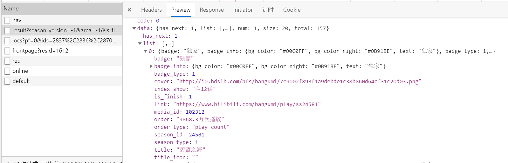
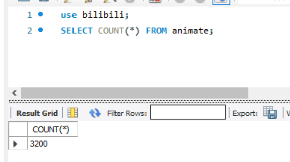
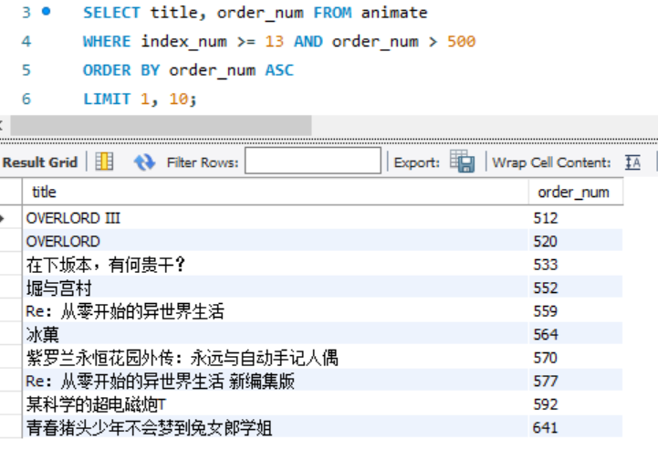
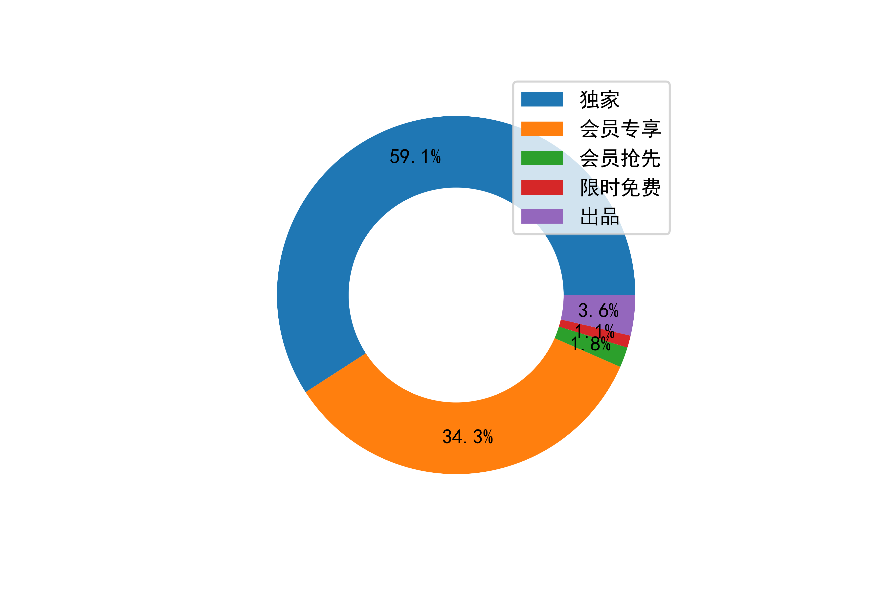

# 数据库概论——作业5：网页爬虫

朱家祺

1700012136

[TOC]

简介：本次作业通过爬虫爬取了b站动漫的排行榜数据，并将数据存储到MySQL数据库中；又用爬虫爬取了b站的动漫评论，并将内容存储到文本文件中。在存储完成后，我对排行榜数据进行了一些查询操作来分析数据并进行可视化；对动漫评论分词并制作了词云。

## 1 网页爬虫

### 1.1 排行榜数据的爬虫思路

本次爬取的[b站动漫排行榜](https://www.bilibili.com/anime/index/#season_version=-1&area=-1&is_finish=-1&copyright=-1&season_status=-1&season_month=-1&pub_date=-1&style_id=-1&order=2&st=1&sort=0&page=1&year=-1)网页截图如下：


其中展示了每个动漫的名称、追番人数、播放类型（会员专享/独家等）、剧集数等信息，我主要对这些信息进行爬取。

首先观察到翻页是用GET请求来实现的，因此可以用Python 提供的requests 包来构造GET请求。此外，我发现网页上的信息是用ajax异步渲染上的，所以只爬取原网页是无效的，应该爬取对应的XHR文件。我找到了对应的XHR文件如下：



因此，爬虫的总体思路是：

- 发起GET请求
- 对每一页爬取XHR文件
- 解析文件，获取所需数据

为了防止ip被封，我在爬取每一页后会随机等待几秒。爬虫的主要代码片段如下：

```python
# 配置爬取的url和请求信息
config = {
    "header": {
        'user-agent': 'Mozilla/5.0 (Windows NT 6.1; Win64; x64) AppleWebKit/537.36 (KHTML, like Gecko) Chrome/67.0.3396.99 Safari/537.36'
    },
    "base_url": "https://api.bilibili.com/pgc/season/index/result",
    "param": {
        "season_version": "-1",
        "area": "-1",
        "is_finish": "-1",
        "copyright": "-1",
        "season_status": "-1",
        "season_month": "-1",
        "year": "-1",
        "style_id": "-1",
        "order": "3",
        "st": "1",
        "sort": "0",
        "season_type": "1",
        "pagesize": "20",
        "page": "1",
        "type": "1"
    }
}
```

```python
# 爬虫爬取网页
def get_text(self, param):
    r = requests.get(self.base_url, params=param, headers=self.header)
    return r.text

def get_rank_pages(self, table, start=1, end=167):
    for page in range(start, end + 1):
        # 对爬取的每一页解析内容
        self.param["page"] = str(page)
        web_text = self.get_text(self.param)
        js = json.loads(web_text)
        for ele in js["data"]["list"]:
            item = {}
            item["title"] = ele["title"]
            item["badge"] = ele["badge"]
            result = re.findall(r"\d+", ele["index_show"])
            if len(result) > 0:
                item["index_num"] = int(result[0])
            else:
                item["index_num"] = None
            item["finish"] = ele["is_finish"]
            result = re.findall(r"\d+", ele["order"])
            if len(result) > 0:
                item["order_num"] = float(result[0])
                if not "万" in ele["order"]:
                    item["order_num"] /= 10000
            else:
                item["order_num"] = None
            item["media_id"] = ele["media_id"]
            for key in item.keys():
                if item[key] == '':
                    item[key] = None
            self.mysql.insert(table, item)
        print("page ", page)
        time.sleep(random.randint(3, 7))

```

### 1.2 评论数据的爬虫思路

以动漫《鬼灭之刃》为例，它对应的评论区网址为：https://www.bilibili.com/bangumi/media/md22718131/#short

在1.1节爬取的数据中包含每个动漫的`media_id`，其中鬼灭之刃的`media_id=22718131`。可以发现网址的url组成为`'https://www.bilibili.com/bangumi/media/md' + media_id + '#short'`。因此通过从数据库中查询到media_id，我们可以爬取每一部动漫的评论，本次作业只以《鬼灭之刃》为例。

发现动漫评论也是用ajax异步渲染上的，但是其XHR文件的url格式没有明显的规律，所以我没有直接爬取XHR文件，而是利用Selenium驱动浏览器自动下拉来使页面渲染更多的评论，然后直接爬取渲染好的页面。

其思路如下：

- 打开网页
- 自动下拉滚动条
- 分析网页结构，找到评论留言的位置
- 爬取内容

代码如下：

```python
url_review = 'https://www.bilibili.com/bangumi/media/md' + media_id + '/#short'
browser = webdriver.Chrome()
try:
    browser.get(url_review)  # 打开网页
    for idx in range(0, 60):
        # 自动下拉滚动条
        js = "var q=document.scrollingElement.scrollTop=10000000"
        browser.execute_script(js)
        time.sleep(random.randint(3, 7))
    # 定位到评论的内容
    elements = browser.find_elements_by_xpath(
        '//*[@class="media-tab-module-content"]/div/div/ul/li/*[@class="review-detail"]/div')
    for element in elements:  # 爬取并存储评论
        f.write(element.text)
        f.write('\n')
        # print(element.text)
finally:
    browser.close()
```


## 2 数据存储

### 2.1 排行榜数据的存储

我将爬取到的动漫排行数据存储到MySQL数据库中。

每一个数据项代表一部动漫，它包括如下字段：

- `id`: 自增主键
- `title`: 动漫名称
- `badge`: 播放类型（会员专享/独家等）
- `index_num`: 剧集数
- `finish`：是否完结
- `order_num`：追番人数
- `media_id`：每部动漫的一个id，用它能对应到其评论区的网址

建表的代码如下：

```python
mp.createTable('''animate (id INT UNSIGNED AUTO_INCREMENT,
                            title VARCHAR(50) NOT NULL,
                            badge VARCHAR(20),
                            index_num INT,
                            finish TINYINT,
                            order_num FLOAT,
                            media_id INT,
                            PRIMARY KEY(id) )''')
```

在与数据库的交互中，我对PyMySQL的功能进行了封装，实现连接、建表、插入数据、查询数据等操作，其代码如下：

```python
class MysqlProxy():
    def __init__(self, host, port, user, password, db):
        self.host = host
        self.port = port
        self.user = user
        self.password = password
        self.db = db

    def connect(self):
        try:
            self.conn = pymysql.connect(
                host=self.host, port=self.port, user=self.user, passwd=self.password, db=self.db)
            self.cursor = self.conn.cursor()
        except Exception as e:
            self.conn = None
            self.cursor = None
            print('error in connect mysql', e)

    def createTable(self, table_sql):
        try:
            self.cursor.execute(
                'CREATE TABLE IF NOT EXISTS {}'.format(table_sql))
            self.conn.commit()
        except Exception as e:
            print("error in create table", table_sql, e)

    def insert(self, table, data):
        try:
            keys = ','.join(data.keys())
            values = ','.join(['%s']*len(data))
            sql = 'INSERT INTO {table} ({keys}) VALUES({values})'.format(
                table=table, keys=keys, values=values)
            self.cursor.execute(sql, tuple(data.values()))
            self.conn.commit()
        except Exception as e:
            print(data)
            print('error in insert', sql, e)
            self.cursor.rollback()

    def select(self, sql):
        try:
            self.cursor.execute(sql)
            row = self.cursor.fetchall()
            return row
        except Exception as e:
            print('error in select', sql, e)
```

利用`MysqlProxy`这个类，我只需要在构造好待插入的数据后，使用`self.mysql.insert(table, item)`来插入排行榜数据。

### 2.2 评论数据的存储

因为评论的内容都是文本信息，不存在关系化的结构，所以可以直接存储到文本文件中。

主体代码如下：

```python
media_id = mp.select('SELECT media_id FROM animate WHERE title="鬼灭之刃"')[0][0]
file = str(media_id) + '.txt'
with open(file=file, mode='w', encoding='utf-8') as f:
    # ...爬取内容
    for element in elements:  # 存储评论
        f.write(element.text)
        f.write('\n')
```

## 3 数据分析

### 3.1 排行榜数据的分析

经查询，总共爬取了3200部动漫的数据。



#### 3.1.1 数据库查询

直接利用数据库查询，可以得到一些关于动漫排行的信息。

例如：查询剧集数大于等于13集的追番量在500万以上的动漫名称和追番量，按照追番量的升序排列，并取前十部。

其对应的SQL如下：

```sql
SELECT title, order_num FROM animate 
WHERE index_num >= 13 AND order_num > 500
ORDER BY order_num ASC
LIMIT 1, 10;
```

其结果如下：


#### 3.2.2 数据分析与可视化

利用PyMysql和Matplotlib，可以对数据库中的数据进行查询并可视化。

例如，统计追番人数超过100万的动漫中，不同播放类型（会员专享/独家等）所占的比例。

代码如下：

```python
mp = MysqlProxy(host="localhost", port=3306, user="root",
                password="TaKagi9905", db="bilibili")
mp.connect()
row = mp.select(
    'SELECT badge, COUNT(badge) FROM animate WHERE order_num > 100 GROUP BY badge')
data = []
label = []
for kv in row:
    if kv[0] != None:
        label.append(kv[0])
        data.append(kv[1])
plt.rcParams['font.sans-serif'] = 'simhei'
plt.rcParams['axes.unicode_minus'] = False


plt.pie(data, pctdistance=0.8, autopct='%.1f%%')

plt.pie([1], radius=0.6, colors='w')
plt.legend(label, loc='upper right')
plt.savefig('figure/circle.png', dpi=600)
plt.show()
```

结果如下：



可见有大约35%的高人气动漫都被设置为会员专享，只有成为大会员才能观看。这也是b站的主要盈利手段之一。

### 3.2 用评论数据制作词云

首先使用`jieba`库进行中文分词，然后用`wordcloud`库制作词云。主要代码如下：

```python
with open(file, mode='r', encoding='utf-8') as f:
    lines = f.read()
    words = jieba.lcut(lines)
    reviews = " ".join(words)
# 词云图设置
wc = wordcloud.WordCloud(width=1000,
                         height=800,
                         background_color='white',
                         font_path='msyh.ttc',
                         scale=15,
                         stopwords=set([line.strip() for line in open('stop_words.txt', mode='r', encoding='utf-8').readlines()]))
# 给词云图输入文字
wc.generate(reviews)
# 保存词云图
wc.to_file('output.png')
```

制作的词云效果如下：


可以看出大多数用户都很喜爱这部动漫。

## 4 体会

- 本次作业让我体验了爬虫爬取网站数据、数据存储和数据分析与可视化。从中了解了多种爬取异步数据的方法，python连接MySQL数据库的方法等，收获很大。
- 在爬虫时主要时间都在分析网页结构和解析内容上，而最终的代码量并不大。这也得益于python与爬虫相关的库封装了很好用的API。